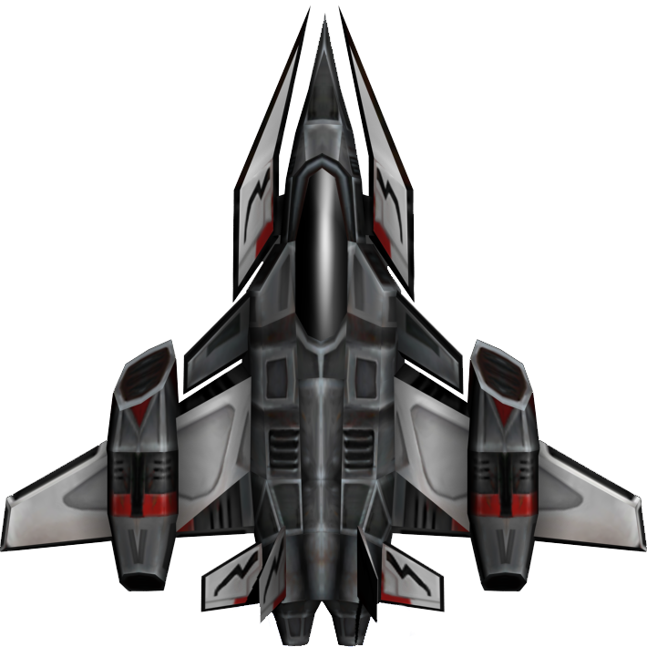
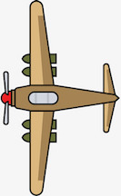

<html>
<body>

<h1>Drone and Airplanes</h1>

Sidescroller game where the user move the
drone to evade incoming airplanes.

<h2>Team Members</h2>

Alvin Nguyen

Darren Wong

Spencer Enriquez

 

<h2>File Creation</h2>
<h3>Alvin:</h3>

FlyingObject.java
Aircraft.java
Drone.java
Plane.java
Hitbox.java

 

<h3>Darren:</h3>

Frame.java
Tester.java
drone.png
airplane.png

 

<h3>Spencer:</h3>

TimeClock.java

 

</body>
</html>
