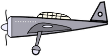

<html>
<body>

<h1>Drone and Airplanes</h1>

Sidescroller game where the user move the
drone to evade incoming airplanes.

The player controls a drone that moves across
a two-dimensional field

The objective of the game is to avoid enemy
aircrafts from colliding with the drone for
two minutes.

When two minutes laspe, then the player wins
one game.

If the player collides with the enemy twice
under two minutes, then the player loses.

<h2>How to Install and Play the Game</h2>

In order to play, you must install Java version 8.0.

<ol>
   <li>Install the repository as a zip file.</li>
   <li>Extract the zip file into a directory.</li>
   <li>Enter the directory where you extracted the zip file.</li>
   <li>Use javac to compile the file "Tester.java".</li>
   <li>Use java to execute "Tester".</li>
</ol>

<h2>Team Members</h2>

Alvin Nguyen

Darren Wong

Spencer Enriquez

 

<h2>File Creation List</h2>

Alvin:

<ul>
   <li>Aircraft.java</li>
   <li>Drone.java</li>
   <li>Plane.java</li>
   <li>Hitbox.java</li>
   <li>RectangleHitbox.java</li>
</ul>
 

Darren:

<ul>
   <li>Frame.java</li>
   <li>Tester.java</li>
   <li>drone.png</li>
   <li>airplane.png</li>
</ul>
 

Spencer:

<ul>
   <li>TimeClock.java</li>
   <li>Scoreboard.java</li>
   <li>Drone and Plane Movement</li>
   <li>Arrow Key to Drone Movement Implementation</li>
   <li>Airplane Spawn / De-spawn Frame Implementation</li>
</ul>
 

</body>
</html>
